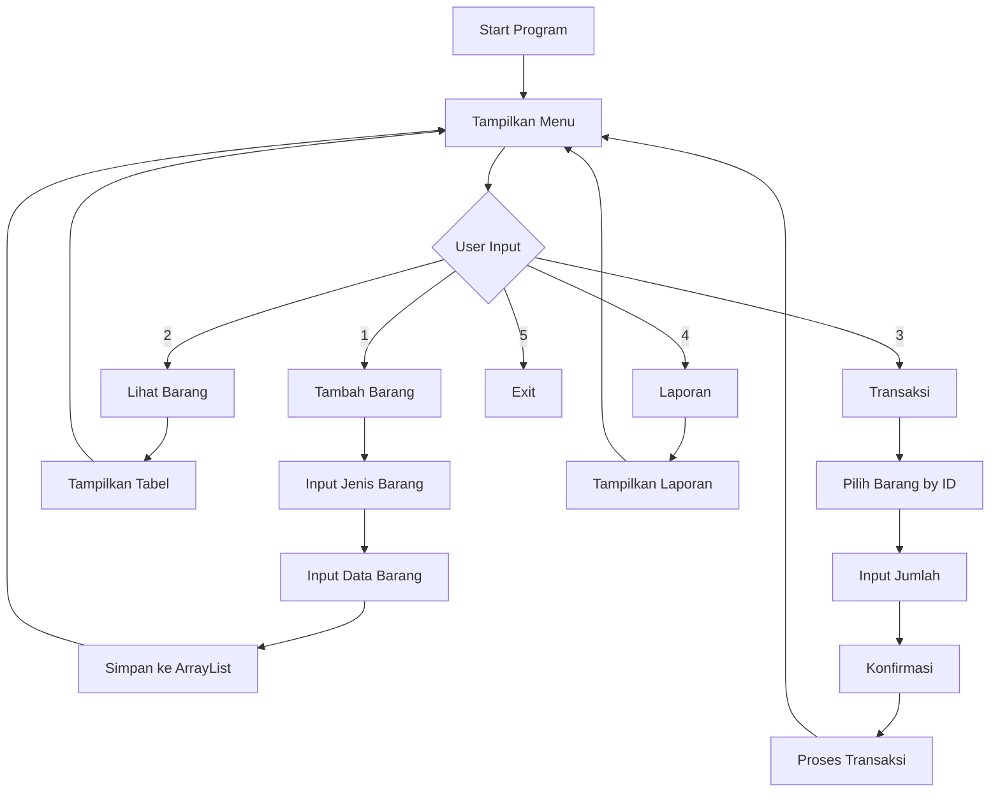
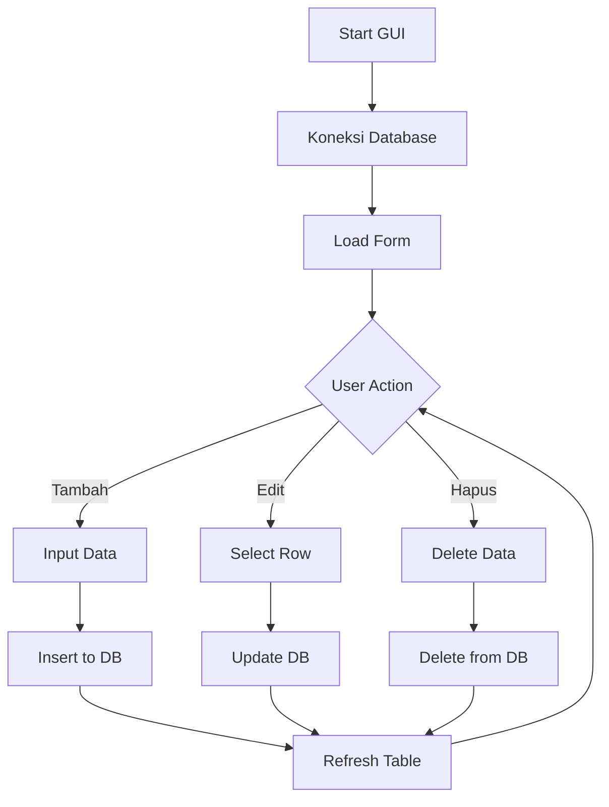

# DOKUMENTASI SISTEM KASIR TOKO - BAGIAN 3
## Fitur, UI Design, dan Implementasi

---

## 🎨 USER INTERFACE DESIGN

### 1. CLI Interface

#### Menu Utama:
```
========================
SISTEM KASIR TOKO
========================
1. Tambah Barang
2. Lihat Barang
3. Transaksi Penjualan
4. Laporan Penjualan
5. Keluar
Pilih menu:
```

#### Tabel Barang:
```
+----+--------------+--------+-------+--------------------------+
| ID | Nama         | Harga  | Stok  | Keterangan               |
+----+--------------+--------+-------+--------------------------+
| 1  | Beras        | 12000  | 50    | Jenis: Sembako          |
| 2  | Laptop       | 5000000| 5     | Jenis: Elektronik       |
+----+--------------+--------+-------+--------------------------+
```

### 2. GUI Interface

#### FormBarang:
- **Layout**: GridBagLayout
- **Komponen**: 
  - TextField untuk input
  - Table untuk menampilkan data
  - Button untuk aksi CRUD
- **Fitur**: Real-time data update

#### FromTransaksi:
- **Layout**: GroupLayout
- **Komponen**:
  - ComboBox untuk pilih barang
  - TextField untuk jumlah
  - Table untuk keranjang
  - Label untuk total

---

## 🔄 ALUR PROGRAM

### 1. Alur CLI Version



### 2. Alur GUI Version



---

## ⚙️ FITUR-FITUR

### 1. Fitur CLI Version

#### ✅ Fitur yang Sudah Diimplementasikan:
- **Manajemen Barang**:
  - Tambah barang (Sembako/Elektronik)
  - Lihat daftar barang dengan format tabel
  - Auto-increment ID
  - Kategorisasi barang

- **Sistem Transaksi**:
  - Pencarian barang berdasarkan ID
  - Perhitungan subtotal otomatis
  - Konfirmasi transaksi
  - Pengurangan stok otomatis

- **Laporan**:
  - Laporan transaksi harian
  - Total pendapatan
  - Detail item per transaksi

- **Data Management**:
  - In-memory storage (ArrayList)
  - Session-based data (hilang saat program ditutup)

#### 🔄 Fitur yang Bisa Dikembangkan:
- Persistensi data (file/database)
- Edit dan hapus barang
- Laporan periode tertentu
- Backup dan restore data

### 2. Fitur GUI Version

#### ✅ Fitur yang Sudah Diimplementasikan:
- **Database Integration**:
  - Koneksi MySQL
  - CRUD operasi barang
  - Real-time data sync

- **User Interface**:
  - Form input yang user-friendly
  - Tabel dengan data terformat
  - Event handling

#### 🔄 Fitur yang Belum Lengkap:
- Form transaksi belum diimplementasikan
- Main GUI class masih kosong
- Detail transaksi belum ada
- Validasi input belum lengkap

---

## 🛠️ TEKNOLOGI YANG DIGUNAKAN

### 1. Bahasa Pemrograman
- **Java** (JDK 8 atau lebih tinggi)
- **Java Swing** (untuk GUI)

### 2. Database
- **MySQL** (untuk GUI version)
- **JDBC Driver** untuk koneksi

### 3. Development Tools
- **NetBeans IDE** (untuk GUI development)
- **Ant Build Tool** (build.xml)
- **Git** (version control)

### 4. Libraries
- **MySQL Connector/J** (JDBC driver)
- **Java Swing** (GUI components)

---

## 🚀 CARA MENJALANKAN PROGRAM

### 1. Menjalankan CLI Version

#### Prerequisites:
- Java JDK 8+ terinstall
- Terminal/Command Prompt

#### Langkah-langkah:
```bash
# 1. Navigate ke direktori CLI
cd "Toko Kasir/CLI"

# 2. Compile semua file Java
javac *.java

# 3. Jalankan program
java TokoKasir
```

### 2. Menjalankan GUI Version

#### Prerequisites:
- Java JDK 8+ terinstall
- MySQL Server terinstall dan running
- NetBeans IDE (optional, untuk development)

#### Setup Database:
```sql
-- 1. Buat database
CREATE DATABASE toko_kasir;

-- 2. Buat tabel barang
CREATE TABLE barang (
    id INT PRIMARY KEY AUTO_INCREMENT,
    nama VARCHAR(100) NOT NULL,
    harga DOUBLE NOT NULL,
    stok INT NOT NULL
);

-- 3. Insert sample data
INSERT INTO barang (nama, harga, stok) VALUES 
('Beras', 12000, 50),
('Minyak Goreng', 15000, 30),
('Laptop', 5000000, 5);
```

#### Menjalankan dari NetBeans:
1. Buka project di NetBeans
2. Clean and Build project
3. Run project

#### Menjalankan dari JAR:
```bash
# Build JAR file
ant jar

# Jalankan JAR
java -jar TokoKasirGUI.jar
```

### 3. Konfigurasi Database

#### File: `Koneksi.java`
```java
String url = "jdbc:mysql://localhost:3306/toko_kasir";
String user = "root";
String pass = ""; // Sesuaikan dengan password MySQL
```

**Catatan**: Pastikan MySQL server running di port 3306 dan database `toko_kasir` sudah dibuat.

---

## 📊 ANALISIS KOMPARASI VERSI

### CLI vs GUI Version

| Aspek | CLI Version | GUI Version |
|-------|-------------|-------------|
| **Kompleksitas** | Sederhana | Menengah |
| **Database** | In-memory | MySQL |
| **UI** | Text-based | Graphical |
| **Fitur** | Lengkap | Partial |
| **Maintenance** | Mudah | Menengah |
| **User Experience** | Basic | Better |
| **Scalability** | Terbatas | Good |

### Kelebihan CLI Version:
- ✅ Implementasi lengkap
- ✅ Penerapan OOP yang baik
- ✅ Mudah dijalankan
- ✅ Tidak memerlukan database

### Kelebihan GUI Version:
- ✅ Interface yang user-friendly
- ✅ Data persistence
- ✅ Real-time updates
- ✅ Professional look

---

## 🔍 ANALISIS KODE QUALITY

### 1. Code Structure
- **CLI**: Well-structured dengan pemisahan kelas yang jelas
- **GUI**: Mengikuti MVC pattern dengan baik

### 2. OOP Implementation
- **Encapsulation**: ✅ Terapkan dengan baik
- **Inheritance**: ✅ Hierarki yang jelas
- **Polymorphism**: ✅ Method overriding yang tepat
- **Abstraction**: ✅ Kelas abstrak yang efektif

### 3. Best Practices
- **Naming Convention**: ✅ Mengikuti Java convention
- **Error Handling**: ⚠️ Perlu ditingkatkan
- **Documentation**: ✅ Ada dokumentasi yang baik
- **Code Reusability**: ✅ Tinggi

### 4. Areas for Improvement
- Exception handling yang lebih robust
- Input validation yang lebih ketat
- Unit testing
- Logging mechanism

---

## 📈 ROADMAP PENGEMBANGAN

### Short Term (1-2 minggu)
1. **Lengkapi GUI Version**:
   - Implementasi form transaksi
   - Integrasi detail transaksi
   - Validasi input

2. **Improve CLI Version**:
   - File-based persistence
   - Better error handling
   - Enhanced reporting

### Medium Term (1 bulan)
1. **Advanced Features**:
   - User authentication
   - Multi-user support
   - Advanced reporting
   - Data export/import

2. **Performance Optimization**:
   - Database indexing
   - Query optimization
   - Memory management

### Long Term (3-6 bulan)
1. **Enterprise Features**:
   - Web-based interface
   - Mobile app
   - Cloud deployment
   - API integration

---

## 🎯 KESIMPULAN

### 1. Achievement
- ✅ Berhasil menerapkan 4 pilar OOP dengan baik
- ✅ Membuat sistem yang functional dan user-friendly
- ✅ Implementasi database integration
- ✅ Dokumentasi yang komprehensif

### 2. Technical Highlights
- **Architecture**: Clean separation of concerns
- **OOP**: Proper implementation of all pillars
- **Database**: Well-designed schema
- **UI/UX**: Intuitive interface design

### 3. Learning Outcomes
- Pemahaman mendalam tentang OOP concepts
- Pengalaman dengan database integration
- Skill dalam GUI development
- Best practices in software development

### 4. Future Recommendations
- Implementasi unit testing
- Enhanced error handling
- Performance optimization
- Feature expansion

---

## 📚 REFERENSI

### Technical References
- Java Documentation: https://docs.oracle.com/javase/
- MySQL Documentation: https://dev.mysql.com/doc/
- NetBeans IDE: https://netbeans.apache.org/
- Java Swing Tutorial: https://docs.oracle.com/javase/tutorial/uiswing/

### OOP References
- "Head First Java" by Kathy Sierra & Bert Bates
- "Effective Java" by Joshua Bloch
- "Clean Code" by Robert C. Martin

---

**Dokumentasi ini dibuat untuk Tugas Besar Pemrograman Berorientasi Objek**
**Universitas Dian Nusantara (UNDIRA) - 2024**

*Dokumentasi lengkap dan detail ini mencakup semua aspek dari sistem kasir toko, mulai dari analisis kode, arsitektur, implementasi OOP, hingga roadmap pengembangan masa depan.* 