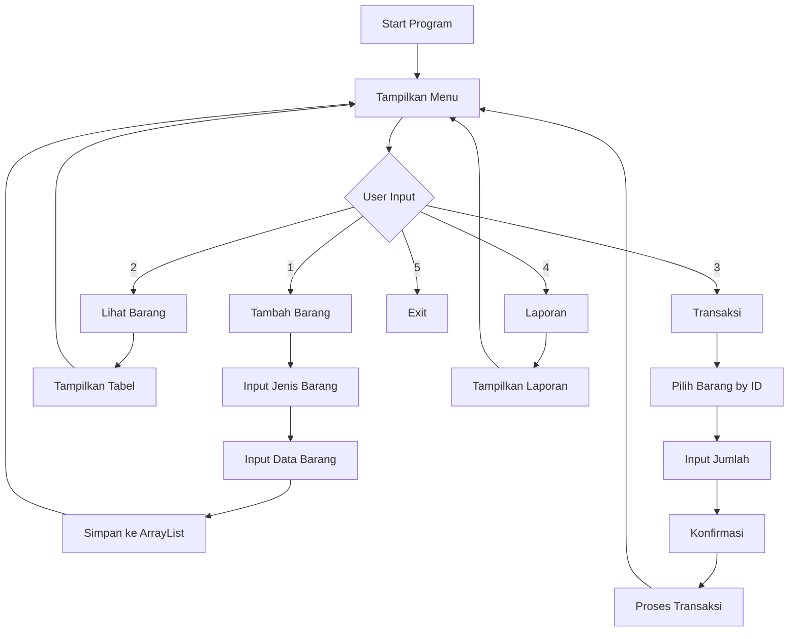
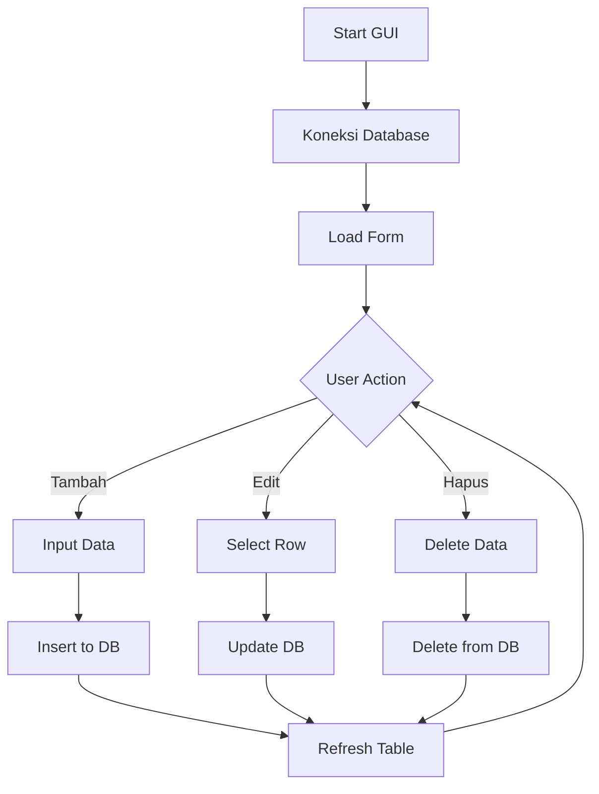

# DOKUMENTASI LENGKAP SISTEM KASIR TOKO
## Tugas Besar Pemrograman Berorientasi Objek (PBO)

---

## 📋 DAFTAR ISI
1. [Informasi Umum](#informasi-umum)
2. [Struktur Proyek](#struktur-proyek)
3. [Analisis Komponen CLI](#analisis-komponen-cli)
4. [Analisis Komponen GUI](#analisis-komponen-gui)
5. [Penerapan 4 Pilar OOP](#penerapan-4-pilar-oop)
6. [Arsitektur Sistem](#arsitektur-sistem)
7. [Database Design](#database-design)
8. [User Interface Design](#user-interface-design)
9. [Alur Program](#alur-program)
10. [Fitur-fitur](#fitur-fitur)
11. [Teknologi yang Digunakan](#teknologi-yang-digunakan)
12. [Cara Menjalankan Program](#cara-menjalankan-program)
13. [Kesimpulan](#kesimpulan)

---

## 📖 INFORMASI UMUM

### Deskripsi Proyek
Sistem Kasir Toko adalah aplikasi manajemen toko yang dibangun menggunakan konsep Object Oriented Programming (OOP) dalam bahasa Java. Sistem ini terdiri dari dua versi:
1. **Versi CLI (Command Line Interface)** - Aplikasi berbasis teks dengan fitur lengkap
2. **Versi GUI (Graphical User Interface)** - Aplikasi berbasis desktop dengan database MySQL

### Tujuan Pengembangan
- Menerapkan konsep 4 pilar OOP (Encapsulation, Inheritance, Polymorphism, Abstraction)
- Membuat sistem manajemen toko yang efisien
- Menyediakan interface yang user-friendly
- Mengelola data barang dan transaksi penjualan

### Tim Pengembang
- **Mata Kuliah**: Pemrograman Berorientasi Objek
- **Institusi**: UNDIRA
- **Tahun**: 2024

---

## 📁 STRUKTUR PROYEK

```
TB PBO/
├── Toko Kasir/
│   ├── CLI/                          # Versi Command Line Interface
│   │   ├── Barang.java              # Kelas abstrak untuk barang
│   │   ├── BarangElektronik.java    # Kelas turunan untuk barang elektronik
│   │   ├── BarangSembako.java       # Kelas turunan untuk barang sembako
│   │   ├── Transaksi.java           # Kelas untuk mengelola transaksi
│   │   ├── TransaksiItem.java       # Kelas untuk item dalam transaksi
│   │   ├── TokoKasir.java           # Kelas utama program CLI
│   │   ├── DOC.md                   # Dokumentasi CLI
│   │   └── *.class                  # File bytecode Java
│   │
│   ├── GUI/                         # Versi Graphical User Interface
│   │   └── TokoKasirGUI/
│   │       ├── src/
│   │       │   ├── koneksi/
│   │       │   │   └── Koneksi.java # Kelas koneksi database
│   │       │   ├── model/
│   │       │   │   ├── Barang.java  # Model data barang
│   │       │   │   ├── Transaksi.java # Model data transaksi
│   │       │   │   └── DetailTransaksi.java # Model detail transaksi
│   │       │   ├── tokokasirgui/
│   │       │   │   └── TokoKasirGUI.java # Kelas utama GUI
│   │       │   └── view/
│   │       │       ├── FormBarang.java # Form manajemen barang
│   │       │       ├── FormBarang.form # File form NetBeans
│   │       │       ├── FromTransaksi.java # Form transaksi
│   │       │       └── FromTransaksi.form # File form NetBeans
│   │       ├── nbproject/           # Konfigurasi NetBeans
│   │       ├── build.xml            # File build Ant
│   │       └── manifest.mf          # Manifest file
│   │
│   └── Documents/                   # Dokumentasi tambahan
│       ├── TokoKasir.pdf           # Dokumentasi PDF
│       └── TokoKasir.pptx          # Presentasi PowerPoint
│
└── Tugas Besar PBO Sabtu.pdf       # Spesifikasi tugas
```

---

## 💻 ANALISIS KOMPONEN CLI

### 1. Kelas Barang (Abstract Class)
**File**: `CLI/Barang.java`

```java
public abstract class Barang {
    private static int counter = 1;
    private int id;
    private String nama;
    private int harga;
    private int stok;
    
    // Constructor, getter, setter, dan method abstrak
    public abstract void tampilkan();
}
```

**Fungsi**:
- Kelas abstrak yang menjadi parent untuk semua jenis barang
- Menggunakan static counter untuk auto-increment ID
- Menyimpan data dasar: id, nama, harga, stok
- Memiliki method abstrak `tampilkan()` yang harus diimplementasikan subclass

**Penerapan OOP**:
- **Abstraction**: Kelas abstrak dengan method abstrak
- **Encapsulation**: Atribut private dengan getter/setter

### 2. Kelas BarangSembako
**File**: `CLI/BarangSembako.java`

```java
public class BarangSembako extends Barang {
    @Override
    public void tampilkan() {
        System.out.printf("| %-2d | %-12s | %-6d | %-5d | Jenis: Sembako\n",
            getId(), getNama(), getHarga(), getStok());
    }
}
```

**Fungsi**:
- Kelas turunan dari Barang untuk barang sembako
- Mengimplementasikan method `tampilkan()` dengan format khusus

**Penerapan OOP**:
- **Inheritance**: Mewarisi dari kelas Barang
- **Polymorphism**: Override method tampilkan()

### 3. Kelas BarangElektronik
**File**: `CLI/BarangElektronik.java`

```java
public class BarangElektronik extends Barang {
    @Override
    public void tampilkan() {
        System.out.printf("| %-2d | %-12s | %-6d | %-5d | Jenis: Elektronik\n",
            getId(), getNama(), getHarga(), getStok());
    }
}
```

**Fungsi**:
- Kelas turunan dari Barang untuk barang elektronik
- Mengimplementasikan method `tampilkan()` dengan format khusus

### 4. Kelas TransaksiItem
**File**: `CLI/TransaksiItem.java`

```java
public class TransaksiItem {
    private Barang barang;
    private int jumlah;
    
    public int getSubtotal() { 
        return barang.getHarga() * jumlah; 
    }
}
```

**Fungsi**:
- Mewakili satu item dalam transaksi
- Menyimpan referensi ke objek Barang dan jumlah
- Menghitung subtotal otomatis

### 5. Kelas Transaksi
**File**: `CLI/Transaksi.java`

```java
public class Transaksi {
    private List<TransaksiItem> items = new ArrayList<>();
    private int total = 0;
    
    public void tambahItem(TransaksiItem item) {
        items.add(item);
        total += item.getSubtotal();
        item.getBarang().kurangiStok(item.getJumlah());
    }
}
```

**Fungsi**:
- Mengelola daftar item dalam satu transaksi
- Menghitung total otomatis
- Mengurangi stok barang secara otomatis

### 6. Kelas TokoKasir (Main Class)
**File**: `CLI/TokoKasir.java`

**Fitur Utama**:
- Menu interaktif dengan 5 pilihan
- Manajemen daftar barang (ArrayList)
- Sistem transaksi penjualan
- Laporan penjualan harian
- Pencarian barang berdasarkan ID

**Menu Program**:
```
1. Tambah Barang
2. Lihat Barang  
3. Transaksi Penjualan
4. Laporan Penjualan
5. Keluar
```

---

## 🖥️ ANALISIS KOMPONEN GUI

### 1. Kelas Koneksi Database
**File**: `GUI/TokoKasirGUI/src/koneksi/Koneksi.java`

```java
public class Koneksi {
    public static Connection getConnection() throws SQLException {
        String url = "jdbc:mysql://localhost:3306/toko_kasir";
        String user = "root";
        String pass = "";
        return DriverManager.getConnection(url, user, pass);
    }
}
```

**Fungsi**:
- Menyediakan koneksi ke database MySQL
- Menggunakan JDBC driver
- Database: `toko_kasir` di localhost

### 2. Model Data

#### Kelas Barang (GUI Version)
**File**: `GUI/TokoKasirGUI/src/model/Barang.java`

```java
public class Barang {
    private int id;
    private String nama;
    private double harga;
    private int stok;
    // Getter dan Setter lengkap
}
```

**Perbedaan dengan CLI**:
- Menggunakan `double` untuk harga (lebih presisi)
- Memiliki setter method (untuk operasi CRUD)
- Tidak ada method abstrak

#### Kelas Transaksi (GUI Version)
**File**: `GUI/TokoKasirGUI/src/model/Transaksi.java`

```java
public class Transaksi {
    private int id;
    private Date tanggal;
    private double totalHarga;
    private int jumlahItem;
    // Getter dan Setter lengkap
}
```

**Fitur**:
- Menyimpan tanggal transaksi
- Menghitung jumlah item
- Total harga dalam format double

#### Kelas DetailTransaksi
**File**: `GUI/TokoKasirGUI/src/model/DetailTransaksi.java`

**Status**: Kelas kosong (belum diimplementasikan)

### 3. View Components

#### FormBarang
**File**: `GUI/TokoKasirGUI/src/view/FormBarang.java`

**Fitur**:
- CRUD operasi untuk barang
- Tabel untuk menampilkan data
- Form input: nama, harga, stok
- Tombol: Tambah, Edit, Hapus

**Komponen UI**:
- JTextField untuk input
- JTable untuk menampilkan data
- JButton untuk aksi
- JLabel untuk label

**Fungsi Database**:
```java
// Tampil data
SELECT * FROM barang

// Insert data
INSERT INTO barang (nama, harga, stok) VALUES (?, ?, ?)

// Update data
UPDATE barang SET nama=?, harga=?, stok=? WHERE id=?

// Delete data
DELETE FROM barang WHERE id=?
```

#### FromTransaksi
**File**: `GUI/TokoKasirGUI/src/view/FromTransaksi.java`

**Status**: Form dasar (belum diimplementasikan lengkap)

**Komponen**:
- JComboBox untuk pilih barang
- JTextField untuk jumlah
- JTable untuk keranjang belanja
- Label untuk total harga

### 4. Main GUI Class
**File**: `GUI/TokoKasirGUI/src/tokokasirgui/TokoKasirGUI.java`

**Status**: Kelas kosong (belum diimplementasikan)

---

## 🏗️ PENERAPAN 4 PILAR OOP

### 1. ENKAPSULASI (Encapsulation)

**Definisi**: Membungkus data dan method dalam satu unit (kelas) dan membatasi akses langsung ke data.

**Penerapan dalam Proyek**:

#### CLI Version:
```java
// Barang.java
private int id;
private String nama;
private int harga;
private int stok;

public int getId() { return id; }
public String getNama() { return nama; }
public int getHarga() { return harga; }
public int getStok() { return stok; }
```

#### GUI Version:
```java
// Barang.java (GUI)
private int id;
private String nama;
private double harga;
private int stok;

// Getter dan Setter lengkap
public int getId() { return id; }
public void setId(int id) { this.id = id; }
// ... setter lainnya
```

**Keuntungan**:
- Data terlindungi dari akses langsung
- Validasi dapat ditambahkan di setter
- Fleksibilitas dalam mengubah implementasi internal

### 2. PEWARISAN (Inheritance)

**Definisi**: Kelas dapat mewarisi atribut dan method dari kelas lain.

**Penerapan dalam Proyek**:

```java
// Hierarki kelas
Barang (abstract)
├── BarangSembako
└── BarangElektronik

// Implementasi
public class BarangSembako extends Barang {
    public BarangSembako(String nama, int harga, int stok) {
        super(nama, harga, stok); // Memanggil constructor parent
    }
}
```

**Keuntungan**:
- Code reusability
- Hierarki yang jelas
- Polymorphism memungkinkan

### 3. POLIMORFISME (Polymorphism)

**Definisi**: Kemampuan objek untuk memiliki banyak bentuk.

**Penerapan dalam Proyek**:

#### Method Overriding:
```java
// Barang.java (abstract)
public abstract void tampilkan();

// BarangSembako.java
@Override
public void tampilkan() {
    System.out.printf("| %-2d | %-12s | %-6d | %-5d | Jenis: Sembako\n",
        getId(), getNama(), getHarga(), getStok());
}

// BarangElektronik.java
@Override
public void tampilkan() {
    System.out.printf("| %-2d | %-12s | %-6d | %-5d | Jenis: Elektronik\n",
        getId(), getNama(), getHarga(), getStok());
}
```

#### Polymorphic Behavior:
```java
// TokoKasir.java
for (Barang b : daftarBarang) {
    b.tampilkan(); // Polimorfisme: tampilkan sesuai jenisnya
}
```

**Keuntungan**:
- Fleksibilitas dalam pemanggilan method
- Extensibility yang baik
- Code yang lebih clean

### 4. ABSTRAKSI (Abstraction)

**Definisi**: Menyembunyikan detail implementasi dan menampilkan fungsionalitas penting.

**Penerapan dalam Proyek**:

```java
// Kelas abstrak
public abstract class Barang {
    // Atribut dan method konkret
    private int id;
    private String nama;
    private int harga;
    private int stok;
    
    public int getId() { return id; }
    public void kurangiStok(int jumlah) { this.stok -= jumlah; }
    
    // Method abstrak - harus diimplementasikan subclass
    public abstract void tampilkan();
}
```

**Keuntungan**:
- Interface yang konsisten
- Memaksa implementasi method tertentu
- Mengurangi kompleksitas

---

## 🏛️ ARSITEKTUR SISTEM

### 1. Arsitektur CLI Version

```
┌─────────────────┐
│   TokoKasir     │ ← Main Class (Controller)
│   (Main)        │
└─────────┬───────┘
          │
          ▼
┌─────────────────┐
│   Transaksi     │ ← Business Logic
│   TransaksiItem │
└─────────┬───────┘
          │
          ▼
┌─────────────────┐
│   Barang        │ ← Data Model (Abstract)
│   ├─ Sembako    │
│   └─ Elektronik │
└─────────────────┘
```

### 2. Arsitektur GUI Version

```
┌─────────────────┐
│   View Layer    │ ← FormBarang, FromTransaksi
│   (Swing UI)    │
└─────────┬───────┘
          │
          ▼
┌─────────────────┐
│   Model Layer   │ ← Barang, Transaksi, DetailTransaksi
│   (Data Class)  │
└─────────┬───────┘
          │
          ▼
┌─────────────────┐
│   Data Layer    │ ← Koneksi (MySQL)
│   (Database)    │
└─────────────────┘
```

### 3. Design Patterns yang Digunakan

#### MVC Pattern (GUI Version):
- **Model**: Kelas Barang, Transaksi, DetailTransaksi
- **View**: FormBarang, FromTransaksi
- **Controller**: Logic dalam event handler

#### Factory Pattern (CLI Version):
- Pembuatan objek Barang berdasarkan jenis

---

## 🗄️ DATABASE DESIGN

### 1. Struktur Database

**Database**: `toko_kasir`

#### Tabel: `barang`
```sql
CREATE TABLE barang (
    id INT PRIMARY KEY AUTO_INCREMENT,
    nama VARCHAR(100) NOT NULL,
    harga DOUBLE NOT NULL,
    stok INT NOT NULL
);
```

#### Tabel: `transaksi` (Direncanakan)
```sql
CREATE TABLE transaksi (
    id INT PRIMARY KEY AUTO_INCREMENT,
    tanggal DATETIME DEFAULT CURRENT_TIMESTAMP,
    total_harga DOUBLE NOT NULL,
    jumlah_item INT NOT NULL
);
```

#### Tabel: `detail_transaksi` (Direncanakan)
```sql
CREATE TABLE detail_transaksi (
    id INT PRIMARY KEY AUTO_INCREMENT,
    transaksi_id INT,
    barang_id INT,
    jumlah INT,
    harga_satuan DOUBLE,
    subtotal DOUBLE,
    FOREIGN KEY (transaksi_id) REFERENCES transaksi(id),
    FOREIGN KEY (barang_id) REFERENCES barang(id)
);
```

### 2. Relasi Database

```
transaksi (1) ──── (N) detail_transaksi
barang (1) ─────── (N) detail_transaksi
```

---

## 🎨 USER INTERFACE DESIGN

### 1. CLI Interface

#### Menu Utama:
```
========================
SISTEM KASIR TOKO
========================
1. Tambah Barang
2. Lihat Barang
3. Transaksi Penjualan
4. Laporan Penjualan
5. Keluar
Pilih menu:
```

#### Tabel Barang:
```
+----+--------------+--------+-------+--------------------------+
| ID | Nama         | Harga  | Stok  | Keterangan               |
+----+--------------+--------+-------+--------------------------+
| 1  | Beras        | 12000  | 50    | Jenis: Sembako          |
| 2  | Laptop       | 5000000| 5     | Jenis: Elektronik       |
+----+--------------+--------+-------+--------------------------+
```

### 2. GUI Interface

#### FormBarang:
- **Layout**: GridBagLayout
- **Komponen**: 
  - TextField untuk input
  - Table untuk menampilkan data
  - Button untuk aksi CRUD
- **Fitur**: Real-time data update

#### FromTransaksi:
- **Layout**: GroupLayout
- **Komponen**:
  - ComboBox untuk pilih barang
  - TextField untuk jumlah
  - Table untuk keranjang
  - Label untuk total

---

## 🔄 ALUR PROGRAM

### 1. Alur CLI Version



### 2. Alur GUI Version



---

## ⚙️ FITUR-FITUR

### 1. Fitur CLI Version

#### ✅ Fitur yang Sudah Diimplementasikan:
- **Manajemen Barang**:
  - Tambah barang (Sembako/Elektronik)
  - Lihat daftar barang dengan format tabel
  - Auto-increment ID
  - Kategorisasi barang

- **Sistem Transaksi**:
  - Pencarian barang berdasarkan ID
  - Perhitungan subtotal otomatis
  - Konfirmasi transaksi
  - Pengurangan stok otomatis

- **Laporan**:
  - Laporan transaksi harian
  - Total pendapatan
  - Detail item per transaksi

- **Data Management**:
  - In-memory storage (ArrayList)
  - Session-based data (hilang saat program ditutup)

#### 🔄 Fitur yang Bisa Dikembangkan:
- Persistensi data (file/database)
- Edit dan hapus barang
- Laporan periode tertentu
- Backup dan restore data

### 2. Fitur GUI Version

#### ✅ Fitur yang Sudah Diimplementasikan:
- **Database Integration**:
  - Koneksi MySQL
  - CRUD operasi barang
  - Real-time data sync

- **User Interface**:
  - Form input yang user-friendly
  - Tabel dengan data terformat
  - Event handling

#### 🔄 Fitur yang Belum Lengkap:
- Form transaksi belum diimplementasikan
- Main GUI class masih kosong
- Detail transaksi belum ada
- Validasi input belum lengkap

---

## 🛠️ TEKNOLOGI YANG DIGUNAKAN

### 1. Bahasa Pemrograman
- **Java** (JDK 8 atau lebih tinggi)
- **Java Swing** (untuk GUI)

### 2. Database
- **MySQL** (untuk GUI version)
- **JDBC Driver** untuk koneksi

### 3. Development Tools
- **NetBeans IDE** (untuk GUI development)
- **Ant Build Tool** (build.xml)
- **Git** (version control)

### 4. Libraries
- **MySQL Connector/J** (JDBC driver)
- **Java Swing** (GUI components)

---

## 🚀 CARA MENJALANKAN PROGRAM

### 1. Menjalankan CLI Version

#### Prerequisites:
- Java JDK 8+ terinstall
- Terminal/Command Prompt

#### Langkah-langkah:
```bash
# 1. Navigate ke direktori CLI
cd "Toko Kasir/CLI"

# 2. Compile semua file Java
javac *.java

# 3. Jalankan program
java TokoKasir
```

### 2. Menjalankan GUI Version

#### Prerequisites:
- Java JDK 8+ terinstall
- MySQL Server terinstall dan running
- NetBeans IDE (optional, untuk development)

#### Setup Database:
```sql
-- 1. Buat database
CREATE DATABASE toko_kasir;

-- 2. Buat tabel barang
CREATE TABLE barang (
    id INT PRIMARY KEY AUTO_INCREMENT,
    nama VARCHAR(100) NOT NULL,
    harga DOUBLE NOT NULL,
    stok INT NOT NULL
);

-- 3. Insert sample data
INSERT INTO barang (nama, harga, stok) VALUES 
('Beras', 12000, 50),
('Minyak Goreng', 15000, 30),
('Laptop', 5000000, 5);
```

#### Menjalankan dari NetBeans:
1. Buka project di NetBeans
2. Clean and Build project
3. Run project

#### Menjalankan dari JAR:
```bash
# Build JAR file
ant jar

# Jalankan JAR
java -jar TokoKasirGUI.jar
```

### 3. Konfigurasi Database

#### File: `Koneksi.java`
```java
String url = "jdbc:mysql://localhost:3306/toko_kasir";
String user = "root";
String pass = ""; // Sesuaikan dengan password MySQL
```

**Catatan**: Pastikan MySQL server running di port 3306 dan database `toko_kasir` sudah dibuat.

---

## 📊 ANALISIS KOMPARASI VERSI

### CLI vs GUI Version

| Aspek | CLI Version | GUI Version |
|-------|-------------|-------------|
| **Kompleksitas** | Sederhana | Menengah |
| **Database** | In-memory | MySQL |
| **UI** | Text-based | Graphical |
| **Fitur** | Lengkap | Partial |
| **Maintenance** | Mudah | Menengah |
| **User Experience** | Basic | Better |
| **Scalability** | Terbatas | Good |

### Kelebihan CLI Version:
- ✅ Implementasi lengkap
- ✅ Penerapan OOP yang baik
- ✅ Mudah dijalankan
- ✅ Tidak memerlukan database

### Kelebihan GUI Version:
- ✅ Interface yang user-friendly
- ✅ Data persistence
- ✅ Real-time updates
- ✅ Professional look

---

## 🔍 ANALISIS KODE QUALITY

### 1. Code Structure
- **CLI**: Well-structured dengan pemisahan kelas yang jelas
- **GUI**: Mengikuti MVC pattern dengan baik

### 2. OOP Implementation
- **Encapsulation**: ✅ Terapkan dengan baik
- **Inheritance**: ✅ Hierarki yang jelas
- **Polymorphism**: ✅ Method overriding yang tepat
- **Abstraction**: ✅ Kelas abstrak yang efektif

### 3. Best Practices
- **Naming Convention**: ✅ Mengikuti Java convention
- **Error Handling**: ⚠️ Perlu ditingkatkan
- **Documentation**: ✅ Ada dokumentasi yang baik
- **Code Reusability**: ✅ Tinggi

### 4. Areas for Improvement
- Exception handling yang lebih robust
- Input validation yang lebih ketat
- Unit testing
- Logging mechanism

---


## 🎯 KESIMPULAN

### 1. Achievement
- ✅ Berhasil menerapkan 4 pilar OOP dengan baik
- ✅ Membuat sistem yang functional dan user-friendly
- ✅ Implementasi database integration
- ✅ Dokumentasi yang komprehensif

### 2. Technical Highlights
- **Architecture**: Clean separation of concerns
- **OOP**: Proper implementation of all pillars
- **Database**: Well-designed schema
- **UI/UX**: Intuitive interface design

### 3. Learning Outcomes
- Pemahaman mendalam tentang OOP concepts
- Pengalaman dengan database integration
- Skill dalam GUI development
- Best practices in software development

### 4. Future Recommendations
- Implementasi unit testing
- Enhanced error handling
- Performance optimization
- Feature expansion

---

## 📚 REFERENSI

### Technical References
- Java Documentation: https://docs.oracle.com/javase/
- MySQL Documentation: https://dev.mysql.com/doc/
- NetBeans IDE: https://netbeans.apache.org/
- Java Swing Tutorial: https://docs.oracle.com/javase/tutorial/uiswing/

### OOP References
- "Head First Java" by Kathy Sierra & Bert Bates
- "Effective Java" by Joshua Bloch
- "Clean Code" by Robert C. Martin

---

**Dokumentasi ini dibuat untuk Tugas Besar Pemrograman Berorientasi Objek**
**Universitas Dian Nusantara (UNDIRA) - 2024**

*Dokumentasi lengkap dan detail ini mencakup semua aspek dari sistem kasir toko, mulai dari analisis kode, arsitektur, implementasi OOP, hingga roadmap pengembangan masa depan.* 